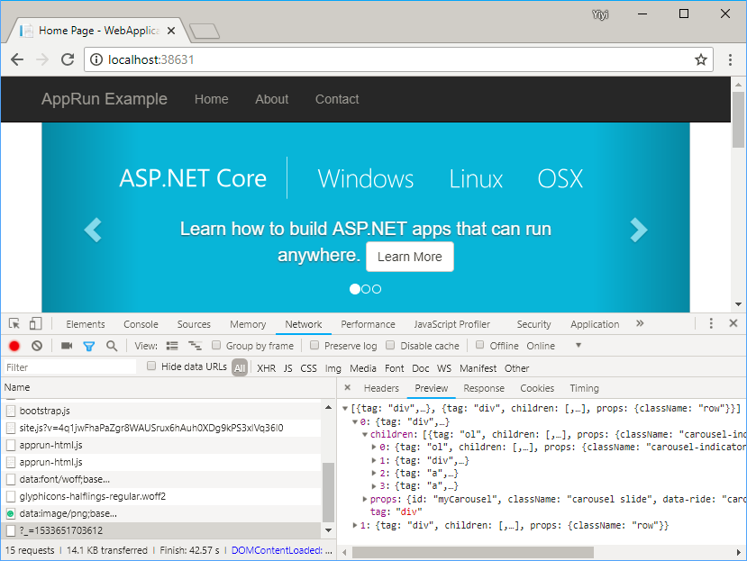

# apprun-ssr-aspnet-core

Use [AppRun](https://github.com/yysun/apprun) to make ASP.NET MVC Core applications into single-page applications (SPA).

Accessing the page directly, the app returns HTML (server-side rendering).


Then AppRun switches it into single-page application mode. The app returns the virtual DOM as JSON for AppRun to render the real DOM.


---

### Example modification to Layout script to enable anchor tags to work within the apprun-app id element 

This will enable anchor tags within your views in the `RenderBody()` to trigger virtual dom updates like the links in the nav bar setup by default in this project.

Just add the code block below to the layout script section in this link: 
https://github.com/yysun/apprun-ssr-aspnet-core/blob/bf173987d7c183318493536360667b6322fe2e5f/WebApplication4/Views/Shared/_Layout.cshtml#L95

```
$('#apprun-app a').on('click', function (event) {
    event.preventDefault();
    const anchor = $(this)[0];
    history.pushState(null, '', anchor.href);
    app.run('/', anchor.pathname);
});
```

---

### TODO: Create a Nuget package
